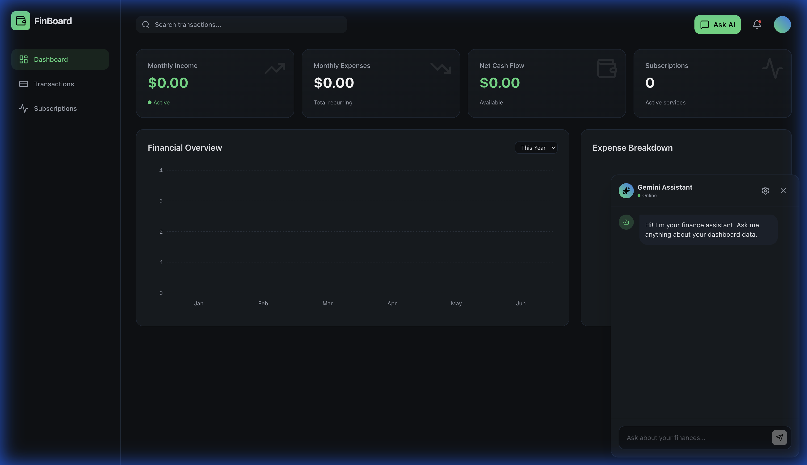

# FinBoard - Personal Finance Dashboard



**FinBoard** is a premium, dark-mode personal finance dashboard built for clarity and speed. It combines modern React architecture with Gemini AI to automate the most tedious parts of tracking your money.

## ✨ Core Features

- **🤖 Intelligent Statement Parsing:** Upload PDF or Image statements (Chase, Fold, and more) and let Gemini AI extract transactions, merchants, and categories automatically.
- **✅ Bulk Review Workflow:** Never wonder where your data came from. Review and adjust AI-parsed transactions in a structured bulk-review modal before importing.
- **🛡️ Encrypted Cloud Sync:** Optional Supabase integration with client-side AES-256 encryption. Your financial data stays private, even in the cloud.
- **📱 PWA & Mobile Optimized:** Built with an "Android-First" philosophy. Installable as a progressive web app with fullscreen support for the best mobile experience.
- **📊 Advanced Visualizations:** High-fidelity interactive charts for cash flow, category breakdowns, and monthly trends powered by Recharts.
- **🔄 Smart Deduplication:** Intelligent logic handles "inter-account" noise (like credit card payments appearing on both bank and card statements) to keep your net worth accurate.
- **💬 AI Financial Assistant:** Integrated Gemini chat that has full context of your local data to help you find trends or categorize tricky transactions.

## 🛠️ Technology Stack

- **Frontend:** React 19, Vite, Tailwind CSS
- **Intelligence:** Google Gemini 2.0 Flash
- **Backend (Optional):** Supabase (Auth & Encrypted Sync)
- **Design System:** "Earthy Professional" custom palette
- **Deployment:** Vercel

## 🚀 Getting Started

1.  **Install Dependencies:**
    ```bash
    npm install
    ```

2.  **Start Development Server:**
    ```bash
    npm run dev
    ```

3.  **Configure AI (Optional):**
    - Click the **Sparkles/Ask AI** button.
    - Click the **Settings (gear)** icon and enter your [Google AI Studio Key](https://aistudio.google.com/).

## 🎨 Design Philosophy

FinBoard uses a custom-curated palette designed for long-term usage:
- **Primary (`#8DAA7F`):** Income & Growth
- **Danger (`#D67C7C`):** Expenses & Alerts
- **Secondary (`#88A0AF`):** Information & Utility
- **Dark Neutral (`#0F1115` / `#161B21`):** High-contrast readability

## 📄 License

MIT

